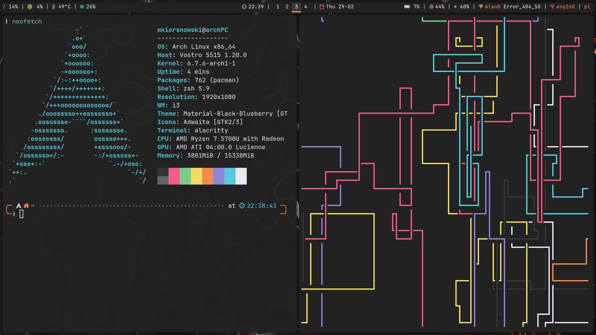
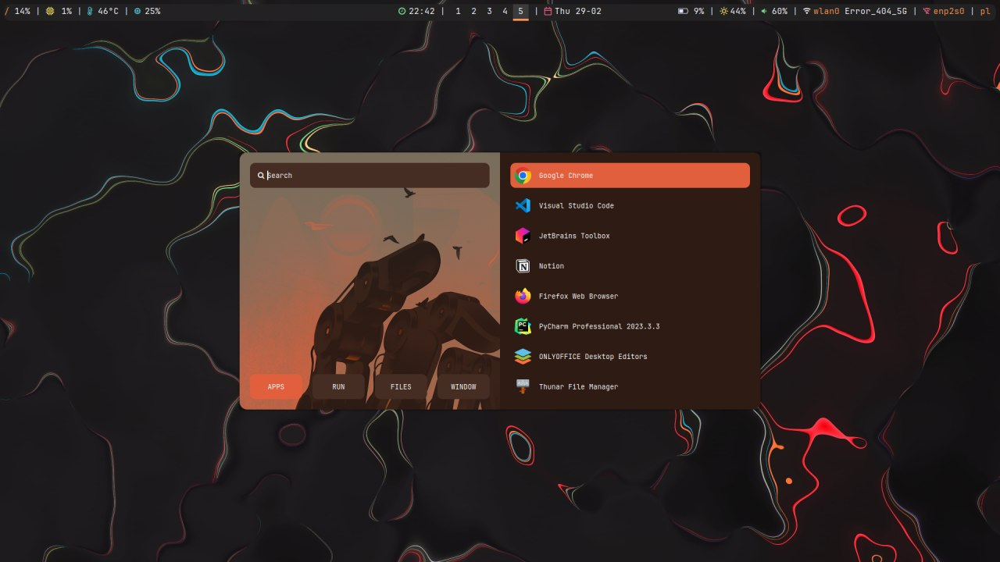
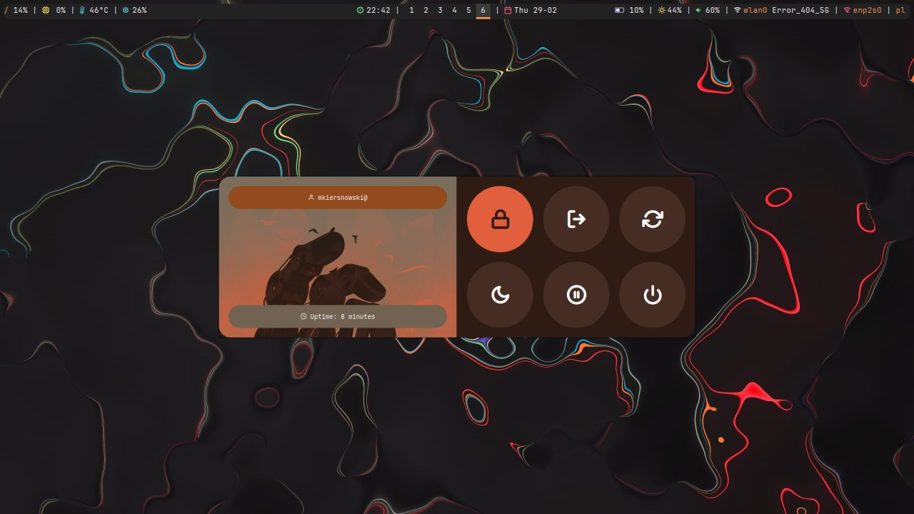

<div align="center">
    <p>
        <a href="/">
            
        </a>
        <a href="/">
            
        </a>
        <a href="/">
            
        </a>
    </p>
</div>

# dotfiles
My dotfiles


# Configuration
| Tool | Arch Linux |
|:-----|:-----------|
| Terminal | Alacritty |
| Shell | zsh |
| Window manager | i3 |
| File manager | Thunar |
| Bar | Polybar |
| Launcher | Rofi |
| Screenshots | Flameshot |
| Lockscreen | betterlockscreen |
| Greeter | SDDM |

# Screenshots
## terminal


## launcher


## powermenu



# Deployment TBD
1. install ansible
```bash
pacman -Syu ansible
```
2. run ansible playbook (TBD)

